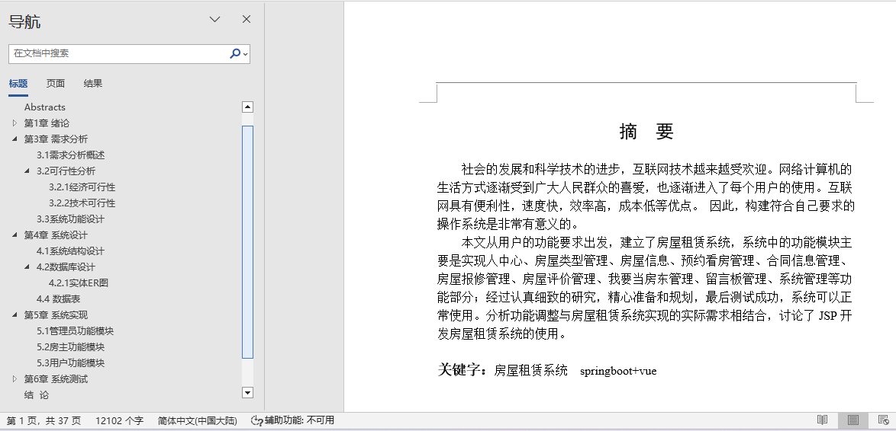
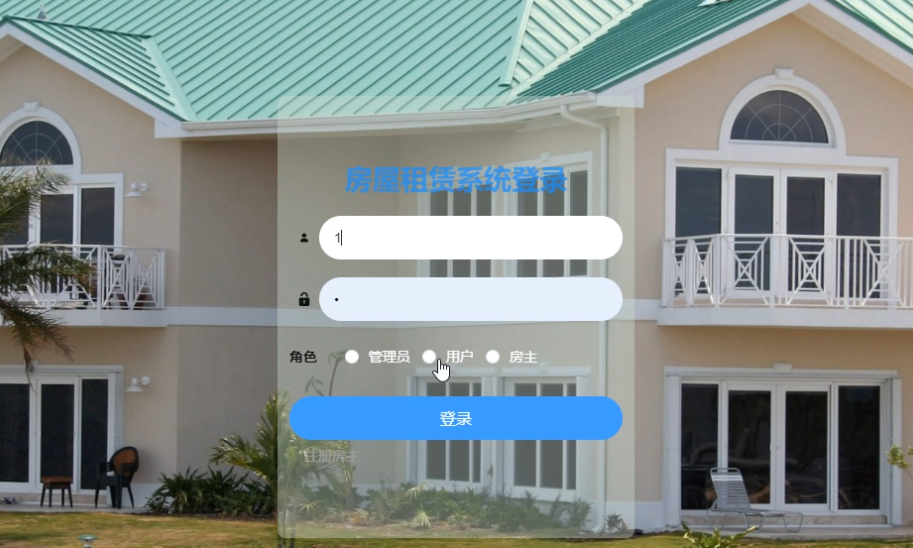
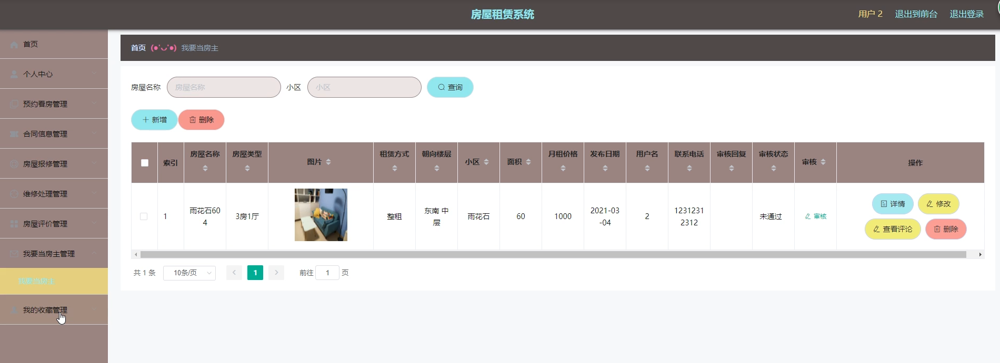
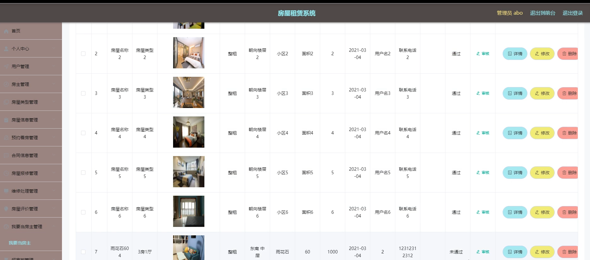

## 基于SpringBoot的房屋租赁系统(程序+报告)

###  获取sql数据库文件: 从戎源码网 (https://armycodes.com/) QQ: 386869957 QQ群: 377586148
###  所有系统地址: (https://github.com/YuLin-Coder/AllProjectCatalog) 
###  所有项目以及源代码本人均调试运行无问题 可支持远程安装部署调试、定制修改、代码讲解

## 项目介绍
基于SpringBoot的房屋租赁系统，系统包含两种角色：用户、管理员，系统分为前台和后台两大模块，主要功能如下：

### 【管理员】:
- 房东管理: 查看、修改、删除和新增房东信息。
- 房屋类型管理: 查看、修改、删除和新增房屋类型。
- 房屋信息管理: 查看、修改、删除和新增房屋信息，以及查看和回复评论。
- 公告信息管理: 查看、修改、删除和新增公告信息。
- 预约看房管理: 查看、审核和删除预约看房信息。
- 我要当房东管理: 查看、修改、删除和审核“我要当房东”信息。

### 【用户】:
- 房源信息: 查看所有要出租的房源信息，按条件查询。
- 房源详细信息: 查看房源详细介绍，收藏房源或进行租房操作。
- 提交租房信息: 提交租房申请，设置申请日期。
- 订单信息管理: 查看和支付租房订单，确认房东审核状态。

### 【房东】:
- 信息审批管理: 查看信息审批状态，通过审核后发布房源信息。
- 房源信息管理: 管理发布的房源信息，发布前需管理员审核。
- 订单信息管理: 查看并审核用户租房订单，确认支付状态。

## 项目技术
- 编程语言：Java
- 数据库：MySQL
- 项目管理工具：Maven
- 前端技术：HTML、CSS、JavaScript、Jquery、Vue
- 后端技术：Spring、SpringMVC、MyBatis

## 运行环境
- JDK版本：JDK1.8及以上
- 开发工具：IDEA、Ecplise、Myecplise都可以
- 数据库: MySQL5.7及以上
- Maven：maven3.0及以上
- Node：14.14.0及以上

## 运行截图

